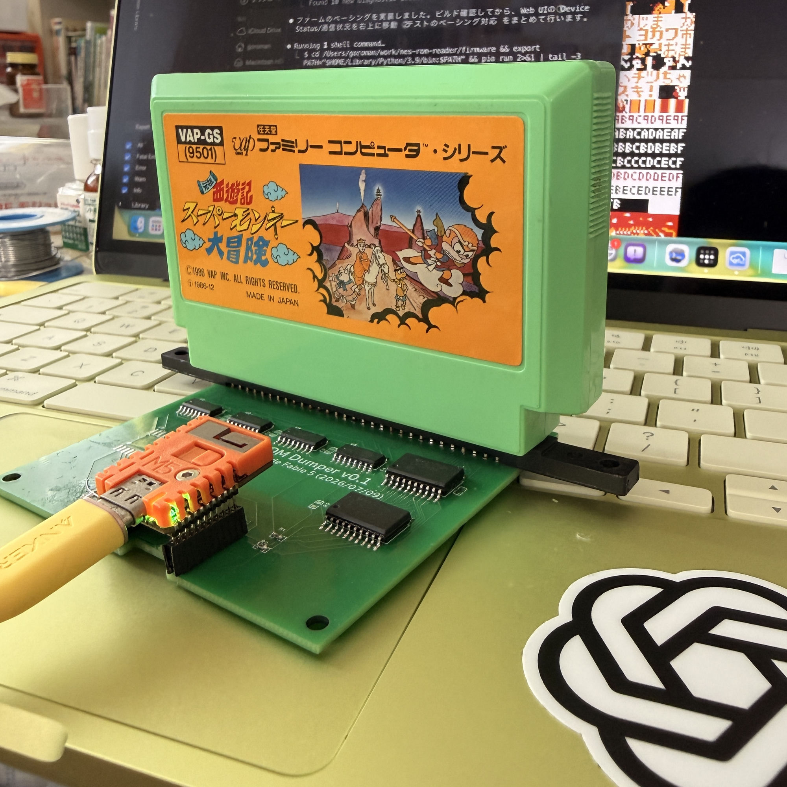
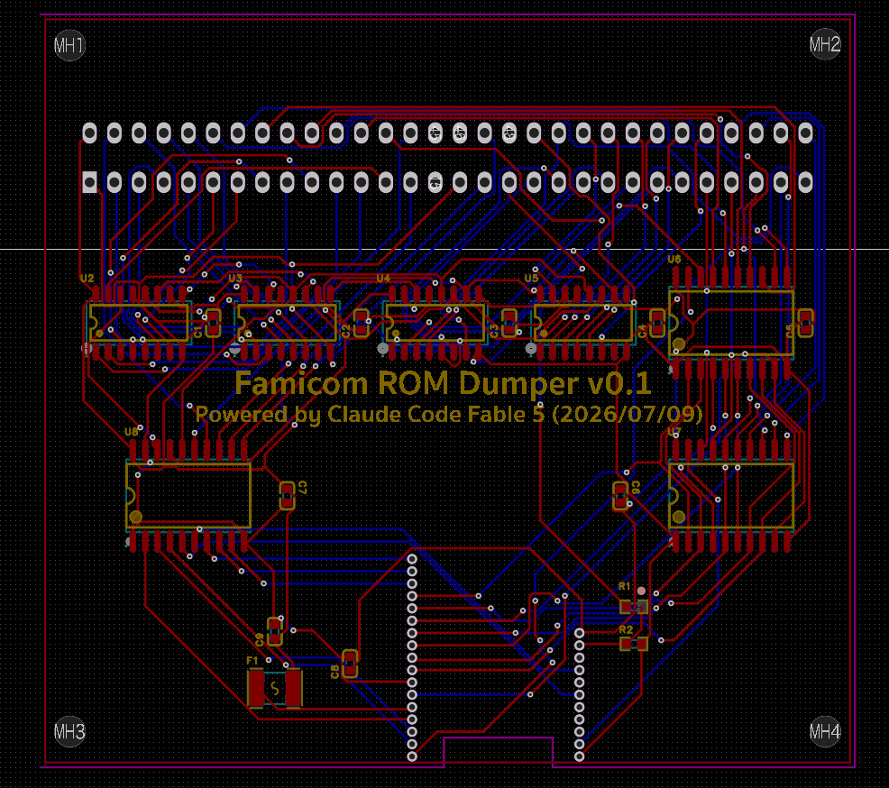
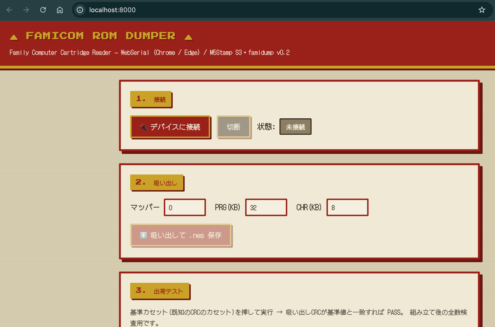
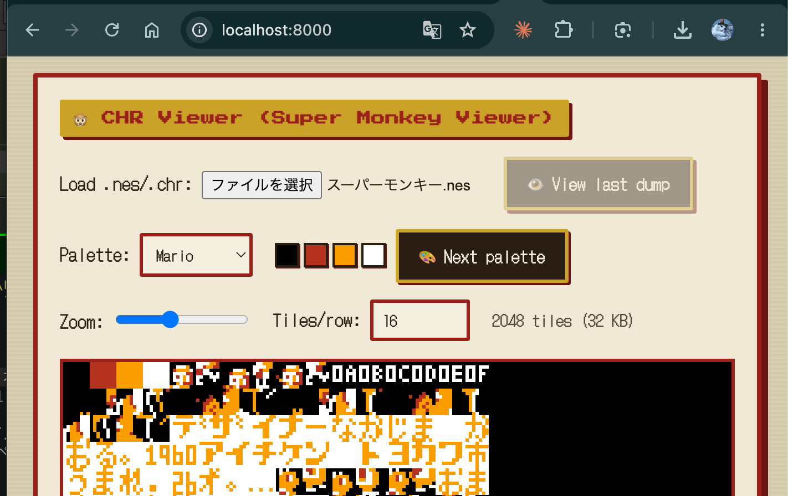

# nes-rom-reader

**English** | [日本語](README.ja.md) | [简体中文](README.zh.md)

A **Famicom (FC 60-pin) cartridge ROM dumper** — open hardware PCB + M5Stamp S3 firmware + a browser Web UI.
Dump your cartridges to `.nes`, inspect the CHR graphics, and even edit tiles — all from Chrome.



> ✅ **Verified on real hardware** — a real cartridge (*Ganso Saiyuki: Super Monkey Daibouken*, VAP 1986)
> dumped with stable, repeatable CRCs.

### ▶ Try it now — no install: **https://goroman.github.io/nes-rom-reader/web/**
Open in Chrome / Edge (desktop or Android), connect an M5Stamp S3, and dump.

---

## Features

- **Dump PRG / CHR** to a standard `.nes` file (iNES header, mirroring auto-detected)
- **CRC32 verification** on every transfer — corruption never passes silently
- **Web UI** over WebSerial — no Python, no drivers. Famicom-styled, EN/JP toggle, Android-responsive
- **🐵 Super Monkey Viewer** — decode CHR into 8×8 tiles, swap palettes, **edit pixels**, and **write text using the cartridge's own font**
- **Factory test** — 100% inspection of assembled boards by reference-cartridge CRC
- **Status LED** — green = ready, blue = busy, red blink = error
- **Open hardware** — EasyEDA project, Gerber, BOM and pick-and-place included

## Repository layout

| Directory | Contents |
|---|---|
| `firmware/` | M5Stamp S3 (ESP32-S3) firmware — PlatformIO / Arduino |
| `host/` | Python CLI: `famidump.py` (dump), `factory_test.py` (inspection) |
| `web/` | Browser Web UI (WebSerial). Served at the URL above |
| `hardware/` | EasyEDA Pro project, Gerber, BOM, pick-and-place |
| `docs/` | Design docs — pin map, bus design, 60-pin pinout |

## Hardware



- **MCU**: M5Stamp S3, mounted on a **1.27 mm-pitch socket** (removable)
- **Cartridge I/F**: FC 60-pin (2.54 mm) edge connector — pads placed directly on the board
- **Address**: 74HCT595 ×4 shift-register chain (5 V)
- **Data**: 74LVC245 ×2 (PRG/CHR, 5 V→3.3 V level shift)
- **Control**: 74HCT541 buffer (3.3 V→5 V)
- 2-layer, ground pour both sides, ~84 × 77 mm, USB-C notch, 4× M3 mounting holes

Fab it yourself: upload [`hardware/gerber/nes-rom-reader-gerber.zip`](hardware/gerber/) to JLCPCB or similar.
See [hardware/README.md](hardware/README.md) and [docs/hardware-design.md](docs/hardware-design.md).

📖 **[Assembly guide (step by step, beginner-friendly)](docs/assembly.en.md)** — tools, soldering order, checks and troubleshooting.

> ⚠️ **Known issue in v0.1**: the M5Stamp S3 does not drop into the board — the Stamp footprint does not
> match the real module. Workaround: raise it on pin headers (documented in the assembly guide). Fixed in v0.2.

## Supported cartridges & limitations

- ✅ **Mapper 0 (NROM)** — fully supported (PRG 32 KB + CHR 8 KB), verified on hardware
- 🧪 **CNROM (mapper 3)** — CHR bank switching implemented via the **bus-conflict** technique (experimental)
- ⚠️ **UNROM / MMC1 and others** — not implemented yet

**How CNROM works here**: the board's data buffers (74LVC245) are fixed-direction/read-only, so we cannot
drive the data bus. But on CNROM the **PRG-ROM keeps driving the bus during a write** (AND-type
[bus conflict](https://www.nesdev.org/wiki/Bus_conflict)) — the same reason games write bank numbers to a ROM
address that already holds that value. So the tool dumps PRG first, finds an address whose byte equals the
desired bank, issues a dummy write cycle there, and the cartridge latch captures it.

Use `--bank-switch` on the CLI, or tick **CHR bank switching** in the Web UI.

> ⚠️ CNROM boards with **copy-protection diodes** create extra bus conflicts that only a dumper actively
> driving the bus can win — those carts still need a write-capable v0.2 board.

## Getting started

### 1. Flash the firmware

```sh
cd firmware && pio run -t upload
```

### 2a. Dump from the browser (recommended)

Open **https://goroman.github.io/nes-rom-reader/web/** → **Connect** → set PRG/CHR size → **Dump & Save .nes**.

### 2b. Dump from the CLI

```sh
pip install -r host/requirements.txt
python host/famidump.py --port /dev/tty.usbmodem* --prg 32 --chr 8 -o game.nes
```

## Web UI



Serve it locally if you prefer (WebSerial needs `https` or `localhost`):

```sh
cd web && python3 -m http.server 8000   # → http://localhost:8000
```

### 🐵 Super Monkey Viewer — CHR tools



- **Tile viewer** — decodes CHR (2bpp planar) into 8×8 tiles; adjustable zoom and tiles-per-row
- **Palettes** — presets (Grayscale / Game Boy / Mario / …) or pick any of the 64 NES master colors per slot
- **Pixel editor** — **double-click a tile** to open an 8×8 dot editor (mouse & touch), then Apply
- **Tile edit** — select a tile to erase it or paste another tile over it
- **Write text with the cartridge font** — CHR messages are just font glyphs placed in order, so give the
  tool the font's start tile and glyph order, type your text, and it stamps the matching glyph tiles
- **Export** — download the edited `.chr` or a rebuilt `.nes`
- Works **offline** too: load any `.nes` / `.chr` file without hardware

## Factory test (100% inspection)

Verifies an assembled board by comparing the dumped CRC of a **reference cartridge**.

```sh
# 1) Learn the reference CRC on a known-good board
python host/factory_test.py --port /dev/cu.usbmodem* --learn --name "MyRefCart"

# 2) Test each board — exit code 0 = PASS, 1 = FAIL
python host/factory_test.py --port /dev/cu.usbmodem* --test --name "MyRefCart"

# Self-test only (no cartridge needed)
python host/factory_test.py --port /dev/cu.usbmodem* --selftest
```

The same flow runs from the Web UI's **Factory Test** panel, which paces each step (~1 s) so you can watch
the status LED. The self-test reads back every output pin, exercises the shift registers, and reports
`SELFTEST PASS/FAIL`.

## Serial protocol

USB CDC, 115200 baud. One-line commands:

| Command | Response |
|---|---|
| `V` | `famidump v0.3` |
| `R <addr_hex> <len_hex>` | `OK <len>` + raw bytes + `CRC xxxxxxxx` (PRG) |
| `C <addr_hex> <len_hex>` | same, for CHR |
| `M` | `H` / `V` / `?` — mirroring |
| `T` | Paced self-test, ends with `SELFTEST PASS/FAIL` |
| `S` | `STATUS famidump-v0.3 mirror=? pins=PASS md=0x20` |
| `B <addr_hex>` | Dummy write cycle at `addr` for CNROM bank select → `BANK xxxx` |

CRC is CRC32 (IEEE 802.3 / `zlib.crc32`-compatible), 8 uppercase hex digits.

## Links

- Repository: https://github.com/GOROman/nes-rom-reader
- Web UI (live): https://goroman.github.io/nes-rom-reader/web/
- Author on X: [@GOROman](https://x.com/GOROman)

## License

**NULL License** — see [LICENSE](LICENSE).

Free to use, modify and redistribute for non-commercial purposes; all rights remain with
**GOROman**. For commercial use or selling hardware based on this design, please get in
touch first: [@GOROman](https://x.com/GOROman). Provided as is, with no warranty.

## Credits

Firmware development and the **EasyEDA Pro** board design (schematic, PCB, routing, fab data) were done by
**[Claude Code](https://claude.com/claude-code) (Fable 5)**, driving EasyEDA Pro through the WebSocket bridge
extension **[eext-run-api-gateway](https://github.com/easyeda/eext-run-api-gateway)**.

---

Powered by Claude Code (Fable 5) × EasyEDA Pro
