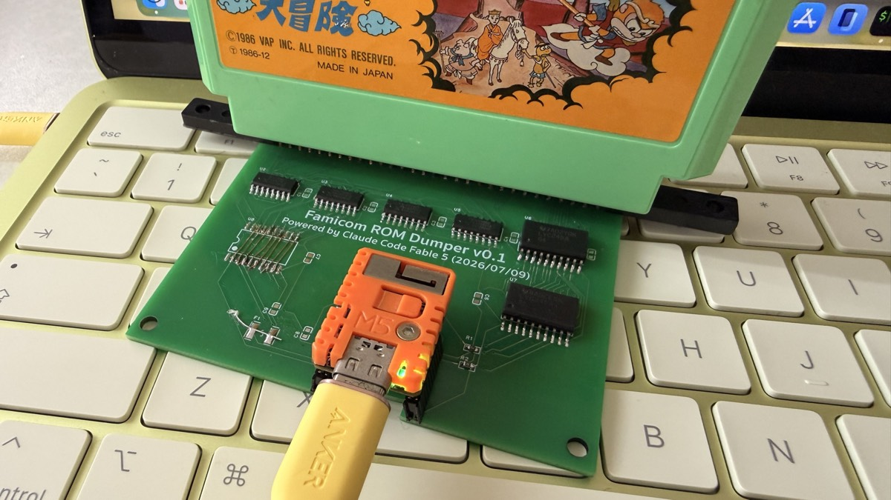
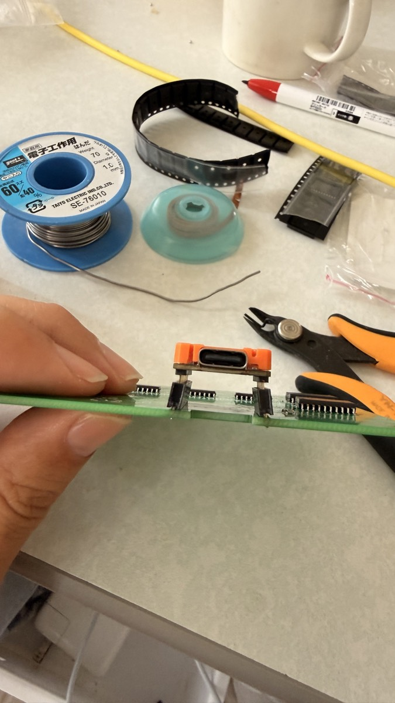
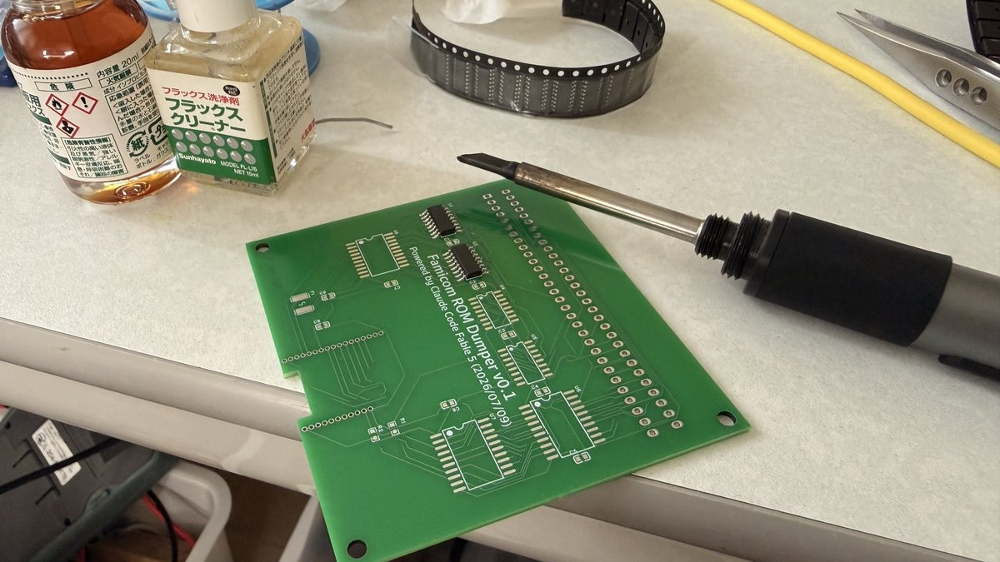
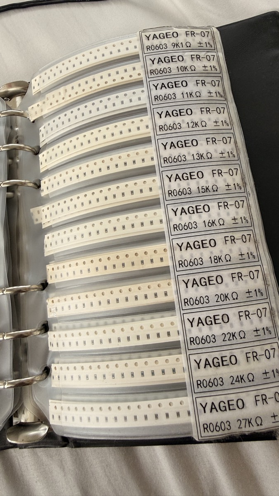
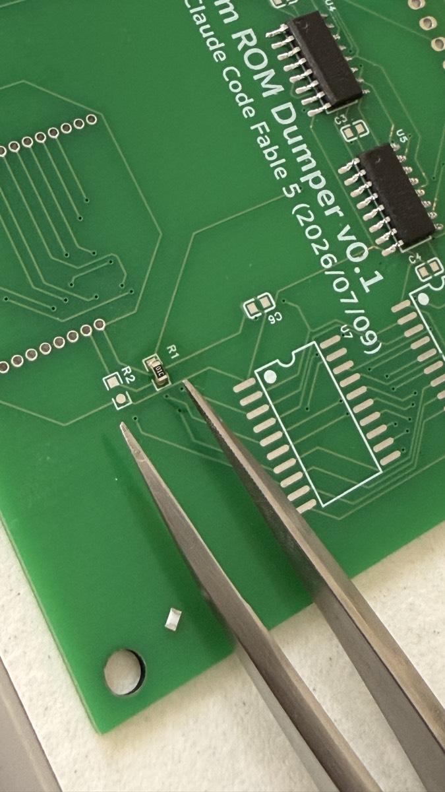
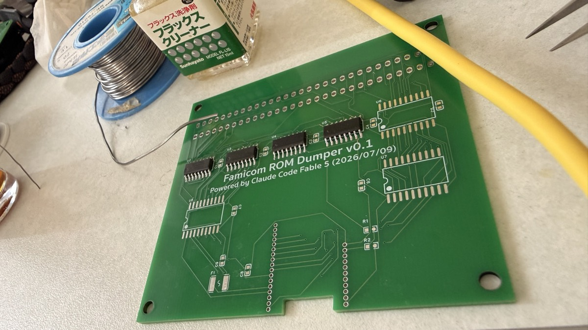
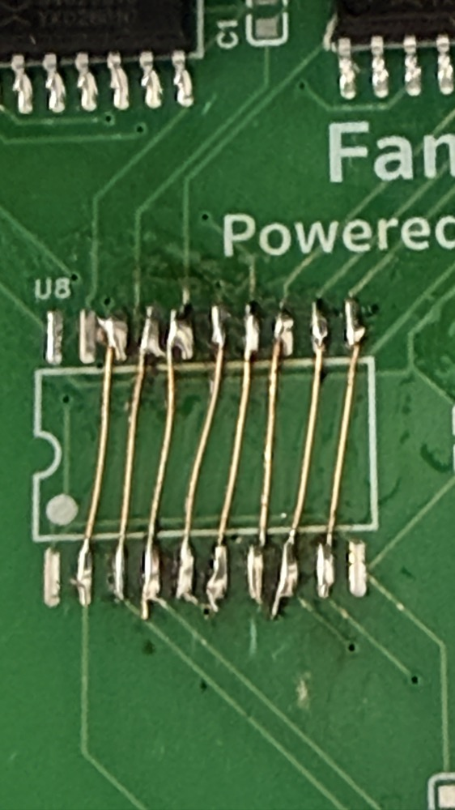
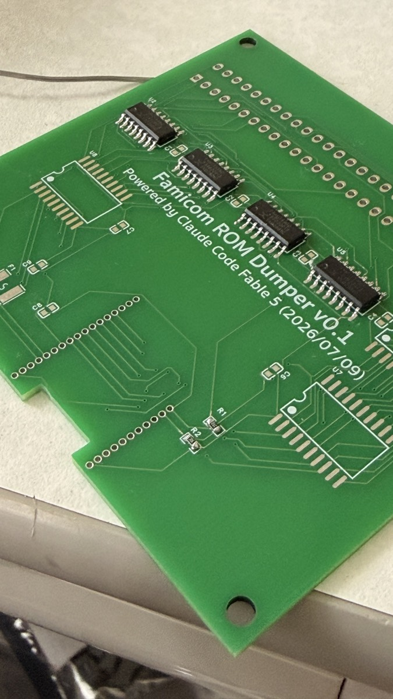

# Assembly Guide (beginner-friendly, step by step)

**English** | [日本語](assembly.md)

How to build the nes-rom-reader v0.1 board, from soldering to a verified dump.
**You can do this even if it's your first SMD soldering.** Budget 1–2 hours.



---

## ⚠️ Read this first — known issue in v0.1

**The M5Stamp S3 does not drop into the v0.1 board.**
The Stamp footprint (hole layout/size) does not match the real module. **This is a design defect.**

**Workaround**: raise the Stamp on pin headers and wire it up (see step 3⑤).



> This will be fixed in the v0.2 board. Please understand this before you start building.

---

## 1. Tools you need

### Essential

| Tool | Notes |
|---|---|
| **Soldering iron** | Temperature-controlled (**280–320 °C**) is ideal. Use a fine **C- or D-shaped tip**. Cheap non-regulated irons make this much harder |
| **Solder** | **Ø0.6 mm rosin-core**. Leaded (Sn60/Pb40) melts easier and is friendlier for beginners |
| **Flux** | **The single most important item.** It massively improves IC soldering success. Paste or pen type |
| **Tweezers** | Fine tips — you'll be placing 1.6 × 0.8 mm chip parts |
| **Solder wick** | For fixing bridges. **Do not skip this** |
| **Multimeter** | For continuity / short checks. A cheap one is fine |

### Very helpful

| Tool | Purpose |
|---|---|
| **UEW (enamelled copper wire)** | For jumper wiring — solders directly without stripping ([2UEW 0.16 mm](https://akizukidenshi.com/catalog/g/g111531/)) |
| **Flux cleaner** | Removes residue afterwards — cleaner result, fewer contact problems |
| Magnifier / loupe | Check bridges and part orientation (a phone camera works too) |
| PCB holder ("helping hands") | Keeps the board still |
| Tip cleaner | Brass-wool type is convenient |



> 💡 **For beginners**: just getting **flux, solder wick, and a temperature-controlled iron**
> makes this dramatically easier. Skimping here is where people struggle.

---

## 2. Parts

### Required

| Part | Ref | Qty | Where / notes |
|---|---|---|---|
| **M5Stamp S3** | U1 | 1 | [Switch Science](https://www.switch-science.com/products/10377) |
| **FC 60-pin cartridge slot** | J1 | 1 | In Tokyo: **Sengoku Denshi, Akihabara (basement B1F)**. Otherwise search "FC 60 pin slot connector" |
| **74HC595 / 74HCT595** (SOIC-16) | U2–U5 | 4 | [Akizuki TC74HC595AF](https://akizukidenshi.com/catalog/g/g110077/) |
| **74LVC245** (SOIC-20) | U6, U7 | 2 | Data buffers (e.g. LCSC C571201) |
| Pin headers (for raising the Stamp) | — | as needed | Needed for the v0.1 workaround (step 3⑤) |

### Optional (it works without these)

| Part | Ref | Qty | Notes |
|---|---|---|---|
| 74HCT541 (SOIC-20) | U8 | 1 | **Can be replaced with jumpers** (see below) |
| 100 nF 0603 ceramic | C1–C8 | 8 | **Decoupling — add them if you want to** |
| 10 µF 0603 ceramic | C9 | 1 | Same |
| Polyfuse 500 mA 1812 | F1 | 1 | **Optional — if you don't have one, just bridge the pads with a jumper** |
| 10 kΩ / 20 kΩ 0603 resistor | R1 / R2 | 1 each | For automatic mirroring detection |
| M3 screws / standoffs | MH1–4 | 4 each | For an enclosure |



> 💡 A **binder-style SMD assortment** like this is handy to own — useful for all kinds of projects.

---

## 3. Soldering (shortest parts first)

Working from **low to tall** keeps the board stable.

```
① Chip resistors R1, R2      ← lowest
② Chip capacitors C1–C9      (optional)
③ Polyfuse F1                (optional)
④ Logic ICs U2–U8
⑤ M5Stamp (raised on headers)
⑥ FC 60-pin connector J1     ← tallest
```

### ① Chip resistors (R1, R2)



**Basic chip-part technique**
1. Tin **one pad only** with a small amount of solder
2. Hold the part with tweezers and **melt that tinned side** to tack it down
3. Solder the other side
4. Reflow the first side to tidy it up

**Identifying them**: resistors have printed codes.
- **R1 = `1002`** (10 kΩ)
- **R2 = `2002`** (20 kΩ)
- No polarity

### ② Chip capacitors (C1–C9) — optional

**Add the decoupling caps if you want to**; the board works without them.
If you do fit them: **capacitors have no printing**, so keep 100 nF (C1–C8) and 10 µF (C9)
separated before opening the bags. No polarity.

### ③ Polyfuse (F1) — optional

**Optional. If you don't have one, bridge the F1 pads with a jumper wire** — you simply lose
the overcurrent protection. No polarity.

### ④ Logic ICs (U2–U8)



**⚠️ Orientation matters most.** Align the IC's **pin-1 marker** (dimple or notch) with the
**dot/notch on the board silkscreen**. Backwards = it won't work.

| Ref | Part | Role |
|---|---|---|
| U2, U3, U4, U5 | 74HC595 (SOIC-16) | Address generation (shift registers) |
| U6, U7 | 74LVC245 (SOIC-20) | Data read buffers |
| U8 | 74HCT541 (SOIC-20) | Control buffer (**optional** — see below) |

**Drag soldering**
1. Tack **only two diagonal pins** to fix the position
2. **Check orientation and alignment now** — it's easy to fix at this stage
3. Apply **plenty of flux** across the pins
4. Put a little solder on the tip and **drag along the pin row**
5. If it bridges, wick it away (add flux — it wicks much better)

> 💡 Don't panic about bridges. Flux + wick fixes them almost every time.

#### 🔧 No 74HCT541 (U8)? Use jumpers

U8 buffers the ESP32's 3.3 V signals up to 5 V, but **reading works without it.**
On the U8 pads, **bridge these pin pairs** with jumper wire (or solder bridges):

```
2–18, 3–17, 4–16, 5–15, 6–14, 7–13, 8–12, 9–11
```



**A real example (photo above).** Eight jumpers running **diagonally and parallel** is what it should look like.

> 💡 **UEW (polyurethane-enamelled copper wire) is the ideal wire** — that's what's used in the photo.
> The **enamel melts under the iron**, so you can solder it directly without stripping. It's thin,
> easy to route, and adjacent wires can touch without shorting.
> Example: [Akizuki 2UEW 0.16 mm, 20 m (¥270)](https://akizukidenshi.com/catalog/g/g111531/)

- The **dot (●) on the U8 outline marks pin 1**. From there the bottom row runs left→right: 1, 2, 3 … 10
- The top row runs right→left: 11, 12 … 20 (so **left→right along the top it reads 20, 19, 18 … 11**)
- Each jumper therefore goes **from the lower-left area up to the upper-right**

> ⚠️ Afterwards, **check a few connections with a multimeter** (e.g. bottom pin 2 ↔ top pin 18)
> and make sure adjacent pins aren't shorted together.

### ⑤ Mounting the M5Stamp (⚠️ v0.1 gotcha)


**The Stamp does not fit the v0.1 board directly.** As shown above, **raise it on pin headers**.

1. Solder pin headers to the board's pad rows
2. Sit the Stamp on top and wire/solder each pin
3. Orient it so the **USB-C connector faces off the board** (toward the notch on the bottom edge)

<details>
<summary>Expected pin order (for cross-checking)</summary>

**Left edge (17 pins, top → bottom)**
`G1, G2, G3, G4, G5, G6, G7, G8, G9, G10, GND, G11, 5V, G12, G13, G14, G15`

**Right edge (11 pins, top → bottom)**
`3V3, G46, G43, G42, G44, G41, EN, G40, G0, G39, GND`
</details>

> ⚠️ Wrong wiring means it won't work. **Check a few pins with a multimeter** before powering up.

### ⑥ FC 60-pin slot connector (J1)



1. Fit it on the **top edge** (the side silkscreened `▼ FRONT`)
2. Solder **only the two end pins** first, then check the connector sits **flush and straight**
3. If it looks good, solder the remaining 58 pins

> 💡 With 60 pins, **re-apply flux every 5–10 pins** for clean joints.
> Inspect for bridges with a loupe afterwards.

---

## 4. Pre-power checks (please don't skip)

**Before plugging in USB**, check for shorts with a multimeter.

| Check | Expected |
|---|---|
| `+5V` to `GND` | **No continuity** (not shorted) |
| `+3V3` to `GND` | **No continuity** |

**If shorted, do not power it up.** Hunt down the solder bridge — IC power pins are the usual suspects.

> 💡 Set the meter to continuity (beep) mode and touch the two points — **no beep is good**.

---

## 5. Flash the firmware

Mount the Stamp, connect USB-C to your PC:

```sh
cd firmware
pio run -t upload
```

**On success the Stamp's onboard LED turns green** (power OK, firmware running).

| LED | Meaning |
|---|---|
| 🟢 Green | Idle / ready |
| 🔵 Blue | Dumping |
| 🔴 Red blink | Error |

---

## 6. Self-test (no cartridge needed)

Open **https://goroman.github.io/nes-rom-reader/web/** in Chrome:

1. Click **Connect** and pick the port
2. Click **⚙ Self-Test (T)**

Each pin is checked at ~1 s intervals; **`SELFTEST PASS`** at the end means you're good.

> ℹ️ The self-test only covers the ESP32-side wiring, not the path to the cartridge.
> The real proof is the dump in the next step.

---

## 7. Dump a real cartridge

> ⚠️ **Always insert/remove cartridges with the power off (USB unplugged).**


1. Push the cartridge **all the way** into the slot
2. Plug in USB → **Connect** in the Web UI
3. Set PRG `32` / CHR `8` (for NROM) and hit **Dump & Save .nes**
4. Check the **PRG-CRC / CHR-CRC** shown

**Dump the same cartridge 2–3 times — if the CRCs match every time, you're done 🎉**

---

## 8. Troubleshooting

### 🔴 PRG CRC changes every time (random data)

**The most common cause is dirty cartridge contacts.**

1. **Insert and remove the cartridge a few times** (this scrapes off oxide). Contact cleaner helps
2. If that doesn't fix it, check continuity:
   - `/ROMSEL`: Stamp `G41` → (U8) → slot **pin 44**
   - CPU data: slot **pins 36–43** → U6
3. Reflow the joints on U6 / U8 (or your jumpers)

> When this actually happened during development, the cause was **cartridge contacts and a flaky jumper**.

### Quick triage table

CHR and PRG use different paths, so the symptom narrows the cause.

| Symptom | Suspect |
|---|---|
| **PRG only** unstable | `/ROMSEL` (slot 44), CPU data (36–43), U6 |
| **CHR only** unstable | `PPU /RD` (slot 17), PPU data (26–29, 57–60), U7 |
| **Both** dead | Power, U8 (or jumpers), shift registers U2–U5 |

### Mirroring shows `?`

No cartridge, bad contact, or a four-screen cartridge. It also shows `?` if you skipped R1/R2 —
**dumping still works** either way.

### LED blinks red

An invalid command or a failed self-test. Check the Web UI log.

### The Stamp isn't detected at all

- Make sure the USB cable is **not charge-only** (you need a data cable)
- Re-check your Stamp wiring (the raised-header workaround) with a multimeter

---

## 9. When it works

- Run your `.nes` in an **emulator (e.g. Mesen)** — if the game boots, the dump is good
- Browse the CHR graphics in the Web UI's **🐵 Super Monkey Viewer** (tile view and pixel editing)
- Built several boards? Use the [factory test](../README.md#factory-test-100-inspection) to check them all

Nice work! 🎮
